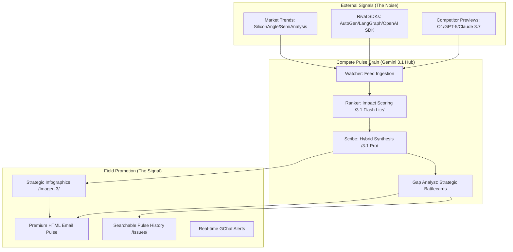

# Compete Pulse: Strategic AI & Agentic Intelligence ⚔️

[](https://github.com/enriquekalven/compete-pulse/actions)
[](https://github.com/google/adk-python)
[](https://cloud.google.com/vertex-ai)

**Compete Pulse** is a high-fidelity intelligence engine designed to track, analyze, and neutralize competitor AI "Launch Theater." It bridges the gap between raw technical updates (LLM benchmarks, SDK releases) and **Enterprise-Ready Sales Plays** for Google Cloud field teams.

---

## 🏗️ Intelligence Architecture



---

## 🎯 Core Intelligence Moats

- **The "Context Moat"**: Automatically identifies opportunities to pitch Gemini's **2M token context window** against competitor context drowning.
- **GA vs. Theater**: Differentiates between competitor "Research Previews" and Google's **General Availability** (GA) stability.
- **Agentic Trinity Integration**: Connects **Vertex AI Models**, **Agent Builder**, and the **ADK** into a unified "Production-Ready" narrative.
- **Grounding Validation**: Highlights Google Search-grade grounding as the ultimate cure for competitor hallucinations.

---

## 🚀 How it Works (The Lifecycle)

### 1. Automated Scrutiny
The **Watcher** scans official release feeds (Vertex AI, Anthropic, OpenAI) and code movements (ADK, A2UI, Genkit) every 24-48 hours.

### 2. Impact Ranking (Flash Engine)
Uses **Gemini 3.1 Flash Lite** to assign a **Strategic Impact Score (1-100)**. This ensures major launches like Gemini 3.1 or Sovereign AI updates are prioritized over minor SDK patches.

### 3. Executive Synthesis (Pro Engine)
Uses **Gemini 3.1 Pro** to distill technical changes into three actionable talk tracks:
*   **Key Feature**: The technical "What."
*   **Customer Value**: The business "Why."
*   **Compete Play**: The tactical "How" to win against the rival solution.

---

## 📂 Strategic Assets
The agent maintains a suite of high-signal documents for the field:
*   [**Key Differentiators**](compete-docs/key_differentiators.md): Strategic breakdown of Google Cloud vs. Competitor Previews.
*   [**Email Pulse Draft**](compete-docs/email_pulse_draft.md): Pre-formatted executive updates for distribution lists.

---

## 🛠️ Field Usage

### Installation
```bash
pip install .
```

### Local Intelligence Report
```bash
compete-pulse report --days 2
```

### Strategic Email Broadcast
```bash
compete-pulse email "field-team@google.com" --infographic
```

### RAG Intelligence Query
```bash
# Query the historical knowledge base for past competitor moves
compete-pulse query "How did we respond to Claude 3.5 Sonnet launch?"
```

---

## 🔐 Environment Configuration
To run the agent locally or in CI/CD, configure the following:

| Variable | Description |
| :--- | :--- |
| `GOOGLE_API_KEY` | API Key for Gemini 3.1 Flash Lite/Pro access. |
| `COMPETE_PULSE_SENDER_EMAIL` | Sender address for automated pulses. |
| `COMPETE_PULSE_SENDER_PASSWORD` | Google **App Password** for secure delivery. |
| `GCHAT_WEBHOOK_URL` | Webhook for real-time corridor alerts. |

---

## 📊 Competitive Intelligence Targets
*   **LLM Model Competes**: Gemini vs. GPT-4o, Claude 3.5/3.7, and Llama 4 benchmarks.
*   **Enterprise Resilience**: GA stability vs. competitor "Waitlist" theater.
*   **Agentic Orchestration**: Vertex AI Agent Builder vs. standalone "Toy" GUI builders.
*   **Sovereignty & Security**: VPC-SC and Data Residency as regional deal-closers.

---

## 🗺️ Roadmap
Check [**ROADMAP.md**](ROADMAP.md) for upcoming RAG enhancements, automated battlecard generation, and internal CRM integration milestones.

---

*Generated & Maintained by the Compete Pulse Agent*
