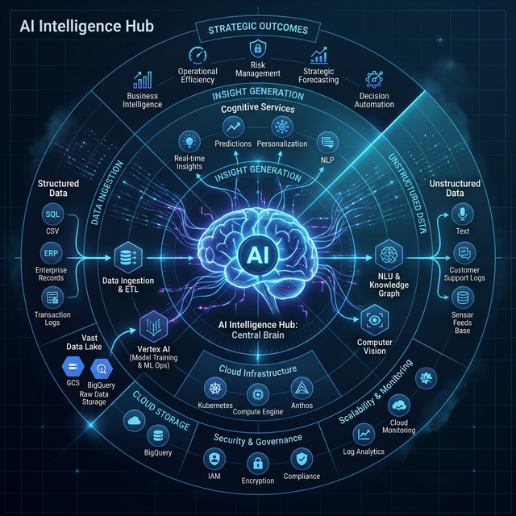
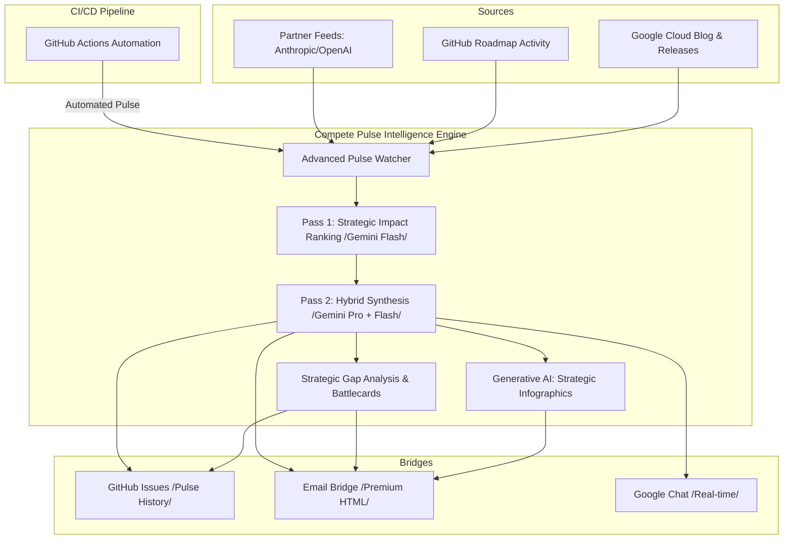

# Compete Pulse: AI & Agentic Intelligence 🚀

A specialized intelligence hub focused on tracking **AI & Agentic** market shifts, LLM model competitions, and Google Cloud's strategic differentiators.



## Architecture


## Features
- **Hybrid Intelligence Strategy**: Orchestrated use of **Gemini 2.5 Pro** for deep executive synthesis and **Gemini 2.5 Flash** for high-velocity technical bridging.
- **Strategic Impact Ranking**: Uses AI to score updates (1-100) based on field relevance, ensuring "Mission Critical" launches (like Gemini 3.1) are never buried by SDK noise.
- **Strategic Battlecards & Gap Analysis**: Automatically compares Google's roadmap against competitors (Anthropic/OpenAI) to identify feature gaps and "First-Mover" advantages.
- **Automated Pulse Infographics**: Generates high-signal visual dashboards of the last 24-48 hours of AI roadmap shifts.
- **Ecosystem Watcher**: Tracks Vertex AI, GitHub codebases (ADK, A2UI, Genkit), and Partner newsrooms in real-time.
- **Enterprise Hardening**: Built-in PII scrubbing, exponential backoff, and prompt-injection validation.

## How it Works
The Compete Pulse Agent follows a structured **Retrieve -> Synthesize -> Promote** lifecycle:

### 1. Automated Retrieval (The "Watcher")
The agent's **Watcher** engine wakes up (via GitHub Actions) and uses custom scrapers to scan:
*   **Official Release Notes**: Vertex AI, Gemini Enterprise, and Generative AI.
*   **Developer Repositories**: Source code movements in the Google ADK and A2UI frameworks.
*   **Industry Trends**: High-signal blogs and market analysis feeds.

### 2. AI Synthesis (The "Brain")
Once retrieval is complete, the raw data is passed through a multi-pass synthesis engine:
*   **Intelligent Ranking**: Use **Gemini 2.5 Flash** to analyze all incoming signals and assign an **Impact Score (1-100)**. This ensures that major releases like Gemini 3.1 always appear first.
*   **Hybrid Deep Extraction**: Uses **Gemini 2.5 Pro** for the high-level executive summary and **Gemini 2.5 Flash** to convert technical changes into 3-bullet talk tracks:
    *   **Key Feature**: Distills the technical essence.
    *   **Customer Value**: Quantifies the business impact.
    *   **Sales Play**: Provides the actionable strategy for field teams.
*   **Strategic Gap Analysis**: Automatically analyzes the interplay between Google, Anthropic, and OpenAI to create a "Field Battlecard."
*   **Strategic Infographics**: Generates visual dashboards directly from the synthesized pulse data.
*   **Safety First**: Integrates a **Hardened PII Scrubber** and **Prompt Injection Validator** to ensure secure summaries.

### 3. Field Promotion (The "Bridges")
The synthesized intel is pushed through various communication bridges:
*   **Email**: A premium HTML report sent directly to field distribution lists.
*   **GitHub Issues**: A persistent, searchable history of all technical pulses.
*   **Google Chat**: Real-time card-based notifications for immediate visibility.

## Installation
```bash
pip install .
```

## Usage
### Local Report
```bash
compete-pulse report
```

### Google Chat Broadcast
```bash
compete-pulse chat --webhook-url "YOUR_WEBHOOK_URL"
```

### Email Promotion
```bash
# Uses COMPETE_PULSE_SENDER_EMAIL and COMPETE_PULSE_SENDER_PASSWORD env vars
compete-pulse email "ai-compete-pulse@google.com"
```
### GitHub Issues Broadcast
```bash
# Uses GITHUB_TOKEN and GITHUB_REPOSITORY env vars
compete-pulse github
```

## Sample Terminal Output
```text
🚀 Compete Pulse Agent: FIELD PROMOTION REPORT (Last 2 Days)

🌉 ROADMAP BRIDGE: FIELD TALK TRACKS
╭─────────────────────────────────────────── [VERTEX-AI-RELEASES] ───────────────────────────────────────────╮
│ Feature: Claude 3.5 Sonnet on Vertex AI                                                                    │
│ Field Impact: PARTNER DEPTH: New Claude models on Vertex. Crucial for customers requesting model-diversity. │
│ Action: Open Documentation                                                                                 │
╰────────────────────────────────────────────────────────────────────────────────────────────────────────────╯
╭────────────────────────────────────────────── [GOOGLE-ADK] ────────────────────────────────────────────────╮
│ Feature: v1.24.0 Release                                                                                   │
│ Field Impact: DEV EXPERIENCE: ADK Update. Promotes standardized agent building. Essential for              │
│ 'Agent-First' architecture talks.                                                                          │
│ Action: Open Documentation                                                                                 │
╰────────────────────────────────────────────────────────────────────────────────────────────────────────────╯

💡 AI KNOWLEDGE & MARKET TRENDS
### Google Cloud AI Blog: Sovereign AI in 2026
Source: Google Cloud AI Blog - Market Trends & Innovations
Actionable Insight: New regulatory trends in EMEA are driving demand for local-residency AI models...
[🔗 Read Full Update]

---
```

## Scheduling (Field Pulse)
The repository includes a GitHub Action (`.github/workflows/pulse.yml`) to automatically process updates.

**Secure Channel Options:**
1. **GitHub Issues (Default)**: Reports are posted as issues in the current repo. Zero-config (uses `GITHUB_TOKEN`).
2. **Google Chat**: Add `GCHAT_WEBHOOK_URL` to GitHub Secrets.
3. **Email**: Add `COMPETE_PULSE_SENDER_EMAIL` and `COMPETE_PULSE_SENDER_PASSWORD` (App Password) to GitHub Secrets.

## Alternative: Markdown Persistence
If communication channels are restricted, you can run the agent to append to a local log:
```bash
compete-pulse report >> FIELD_PILOT_LOG.md
```

## Intelligence Targets (Strategic Compete)
The agent is specifically tuned to analyze market movements and consolidate Google's competitive edge:
- **LLM Model Competes**: Tracking Gemini's performance vs. GPT-4o, Claude 3.5/3.7, and Llama 4 benchmarks.
- **Enterprise Resilience**: Highlighting Google's GA stability vs. competitor "Preview" theater.
- **Agentic Orchestration**: Comparing Vertex AI Agent Builder and ADK to standalone LLM APIs.
- **Context Dominance**: Leveraging Gemini's 2M context window as a primary moat for large-scale enterprise workflows.
- **Security & Sovereignty**: Mapping Cloud IAM and data residency to regional competitive blockers.

---

## 🗺️ Future Growth
See the [**ROADMAP.md**](ROADMAP.md) for planned features, RAG integration, and internal data ingestion milestones.
